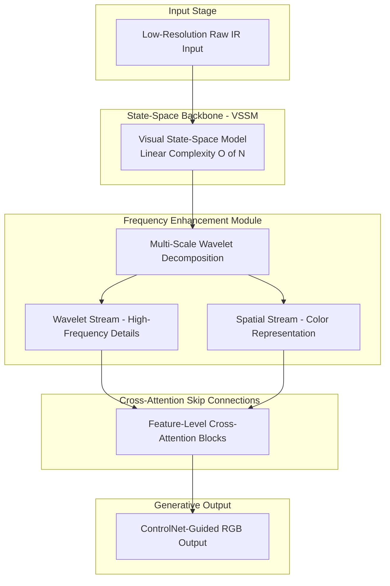
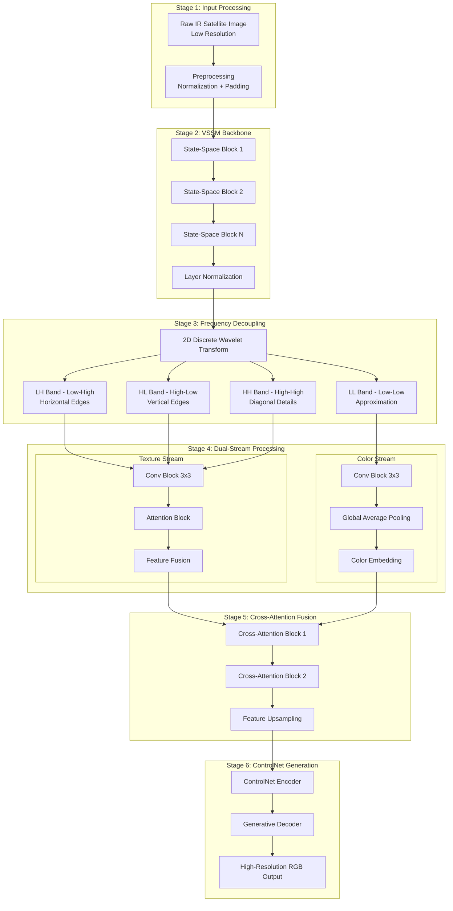
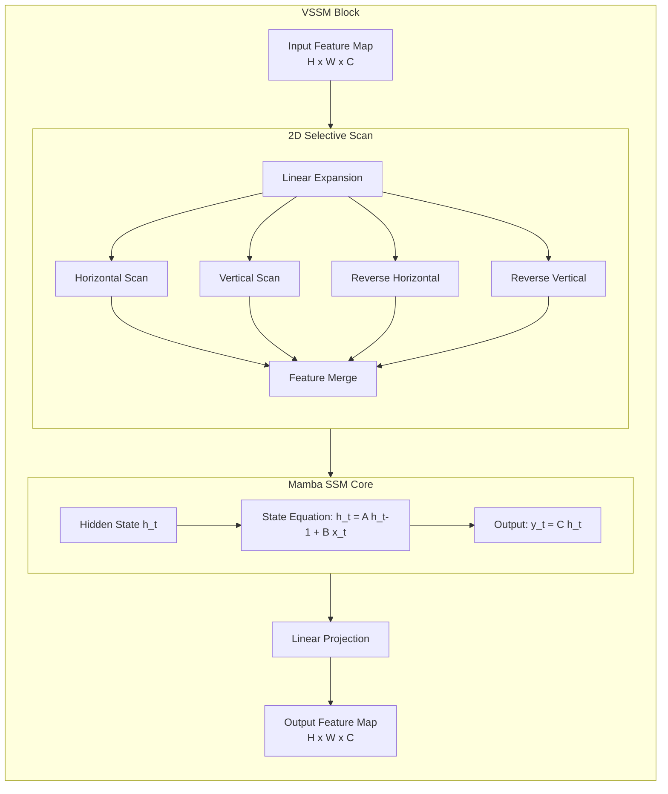
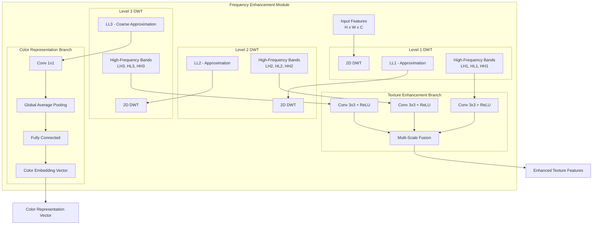
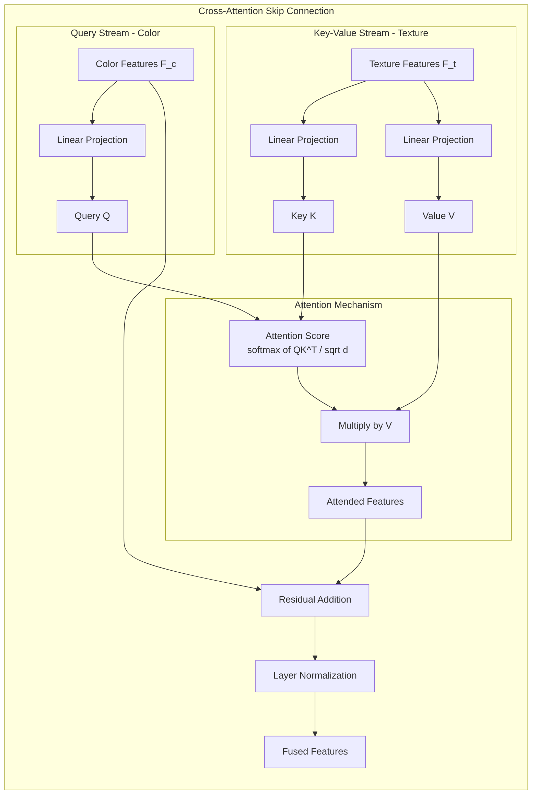
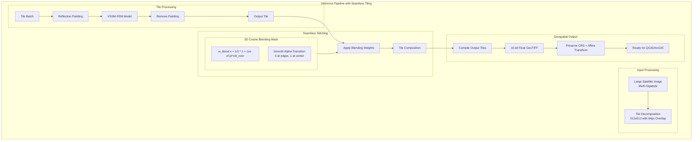
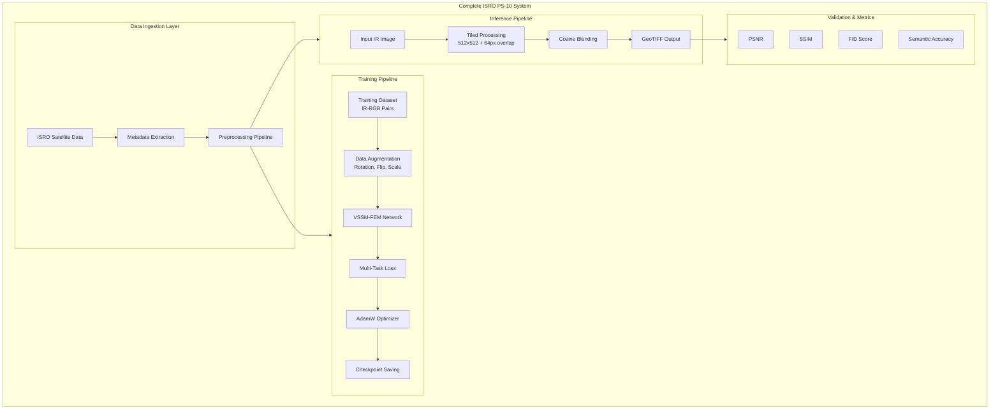

wwwwqw

# ISRO Problem Statement 10: Architecture Design Document

## Dual-Stream, Frequency-Decoupled State-Space Mamba Network with Online Semantic and Direction-Aligned Structural Guardrails

---

## 1. High-Level Architecture Overview

This architecture is specifically designed to resolve engineering failures in remote sensing image processing:

- **Seam Artifacts**: Caused by block-wise tiled inference without geometric edge blending
- **Grayscale/Desaturation Trap**: Where models collapse into monotone palettes due to standard pixel-wise losses



---

## 2. Detailed Pipeline Architecture



---

## 3. Visual State-Space Model (VSSM) Architecture

The VSSM backbone replaces traditional CNNs and Vision Transformers with linear complexity state-space modeling.



### Key Advantages of VSSM:

| Aspect                  | CNN     | Vision Transformer | VSSM/Mamba |
| ----------------------- | ------- | ------------------ | ---------- |
| Receptive Field         | Limited | Global             | Global     |
| Complexity              | O of N  | O of N squared     | O of N     |
| Memory for Large Images | Low     | High               | Low        |
| Long-range Dependencies | Weak    | Strong             | Strong     |

---

## 4. Frequency Enhancement Module (FEM)

The FEM uses multi-level discrete wavelet decomposition to decouple local textures from global styles.



### Wavelet Band Descriptions:

- **LL (Low-Low)**: Approximation coefficients - contains global structure and color information
- **LH (Low-High)**: Horizontal edge details
- **HL (High-Low)**: Vertical edge details
- **HH (High-High)**: Diagonal edge details

---

## 5. Cross-Attention Skip Connections

Cross-attention ensures that boundaries recovered in the infrared domain strictly guide color boundaries.



### Mathematical Formulation:

```
Attention(Q, K, V) = softmax(QK^T / sqrt(d_k)) * V

Where:
- Q = Linear_Q(F_color)  [Query from color stream]
- K = Linear_K(F_texture) [Key from texture stream]
- V = Linear_V(F_texture) [Value from texture stream]
- d_k = dimension of key vectors
```

---

## 6. Multi-Task Loss Function Architecture

```mermaid
flowchart TB
    subgraph LossArchitecture[Multi-Task Loss Formulation]
        subgraph Inputs[Model Outputs]
            PRED[Predicted RGB]
            GT[Ground Truth RGB]
        end
      
        subgraph AdversarialLoss[Adversarial Loss L_adv]
            DISC[Discriminator Network]
            FAKE[Fake Detection Score]
            REAL[Real Detection Score]
            ADV[Binary Cross-Entropy]
          
            PRED --> DISC --> FAKE --> ADV
            GT --> REAL --> ADV
        end
      
        subgraph GradientLoss[Direction-Aligned Gradient Loss L_dir-grad]
            direction TB
            subgraph PredGrad[Predicted Gradients]
                PGX[Gradient X: nabla_x pred]
                PGY[Gradient Y: nabla_y pred]
            end
            subgraph GTGrad[GT Gradients]
                GGX[Gradient X: nabla_x gt]
                GGY[Gradient Y: nabla_y gt]
            end
            subgraph MultiScale[Multi-Scale Computation]
                S1[Scale 1: Full Resolution]
                S2[Scale 2: 2x Downsampled]
                S3[Scale 3: 4x Downsampled]
            end
            GLOSS[L_dir-grad = Sum over scales of L1 of nabla_x + L1 of nabla_y]
          
            PRED --> PGX
            PRED --> PGY
            GT --> GGX
            GT --> GGY
            PGX --> S1
            PGY --> S1
            GGX --> S1
            GGY --> S1
            S1 --> GLOSS
            S2 --> GLOSS
            S3 --> GLOSS
        end
      
        subgraph SemanticLoss[Online Semantic Consistency Loss L_sem]
            direction TB
            SEGFORMER[Frozen SegFormer<br/>Pre-trained Land-Cover Classifier]
            PREDLOG[Predicted Logits P_pred]
            GTLOG[GT Logits P_gt]
            KL[KL Divergence<br/>D_KL of P_gt || P_pred]
          
            PRED --> SEGFORMER --> PREDLOG --> KL
            GT --> SEGFORMER --> GTLOG --> KL
        end
      
        subgraph TotalLoss[Total Loss]
            LAMBDA1[lambda_1]
            LAMBDA2[lambda_2]
            LAMBDA3[lambda_3]
            COMBINE[L_total = lambda_1 * L_adv + lambda_2 * L_dir-grad + lambda_3 * L_sem]
          
            ADV --> COMBINE
            LAMBDA1 --> COMBINE
            GLOSS --> COMBINE
            LAMBDA2 --> COMBINE
            KL --> COMBINE
            LAMBDA3 --> COMBINE
        end
    end
```

### Loss Function Equations:

**Total Loss:**

```
L_total = lambda_1 * L_adv + lambda_2 * L_dir-grad + lambda_3 * L_sem
```

**Direction-Aligned Multi-Scale Gradient Loss:**

```
L_dir-grad = Sum over s in scales of [L1(nabla_x pred_s, nabla_x gt_s) + L1(nabla_y pred_s, nabla_y gt_s)]
```

**Online Semantic Consistency Loss:**

```
L_sem = D_KL(P_gt || P_pred) = Sum over c of P_gt(c) * log(P_gt(c) / P_pred(c))
```

---

## 7. Deployment & Inference Pipeline



### Cosine Blending Weight Formula:

```
w_blend(x) = 1/2 * [1 + cos(pi * x / d_over)]

Where:
- x = position within overlap region [0, d_over]
- d_over = overlap distance (64 pixels)
```

---

## 8. Complete System Architecture



---

## 9. Key Design Decisions Summary

| Component                      | Design Choice               | Rationale                                                                  |
| ------------------------------ | --------------------------- | -------------------------------------------------------------------------- |
| **Backbone**             | VSSM/Mamba                  | Linear O(N) complexity for large satellite images, global receptive field  |
| **Frequency Decoupling** | Multi-level DWT             | Separates texture (high-freq) from color (low-freq), prevents entanglement |
| **Skip Connections**     | Cross-Attention             | Ensures IR boundaries guide color boundaries, prevents bleeding            |
| **Loss Function**        | Multi-task composite        | Prevents grayscale collapse, enforces structural and semantic consistency  |
| **Tiling Strategy**      | 64px overlap + cosine blend | Eliminates seam artifacts from block-wise inference                        |
| **Output Format**        | 16-bit Float GeoTIFF        | Preserves CRS and geotransform for GIS integration                         |

---

## 10. Implementation Recommendations

### Framework Stack:

- **Deep Learning**: PyTorch 2.0+ with `mamba-ssm` package
- **Wavelet Transforms**: PyWavelets (`pywt`)
- **Geospatial**: `rasterio`, `GDAL` for GeoTIFF I/O
- **Semantic Loss**: Pre-trained SegFormer from `transformers`

### Training Configuration:

```yaml
batch_size: 8
tile_size: 512
overlap: 64
learning_rate: 1e-4
lambda_1: 1.0  # Adversarial weight
lambda_2: 10.0  # Gradient loss weight
lambda_3: 5.0   # Semantic loss weight
epochs: 200
```

### Hardware Requirements:

- **Training**: 4x NVIDIA A100 80GB (multi-GPU DDP)
- **Inference**: 1x NVIDIA RTX 4090 24GB (single GPU sufficient)

---

*Document generated for ISRO Problem Statement 10 - Satellite Image Super-Resolution and Colorization*