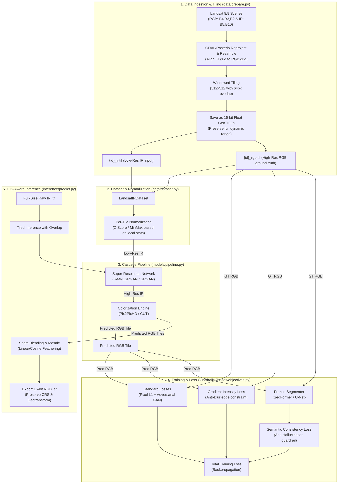

# IR-Colorize: System Workflow & Architecture

This document provides a detailed overview of the workflow, architecture, and loss formulations for the **Infrared Image Colorization & Enhancement** framework, built for the **ISRO Problem Statement 10** (Infrared Image Colorization and Enhancement for Improved Object Interpretation).

---

## 1. System Architecture Diagram

The system is designed as a **two-stage cascade with a loss-only semantic guardrail**. Below is the end-to-end data and model pipeline:

---

## 2. End-to-End Workflow

The framework operates in five distinct phases:

### Phase 1: Geospatial Data Ingestion
* **Source:** Landsat 8/9 Level-2 products. Bands of interest are loaded using `rasterio`:
  * **Visible Spectrum (RGB):** OLI Bands 4 (Red), 3 (Green), and 2 (Blue).
  * **Infrared Spectrum (IR):** NIR Band 5 (Near-Infrared) and TIRS Band 10 (Thermal Infrared).
* **Grid Alignment:** Thermal and NIR bands are reprojected and resampled (typically using bilinear or cubic interpolation) to align precisely with the higher-resolution RGB coordinate grid.
* **Windowed Tiling:** The aligned scenes are split into overlapping tiles (e.g., $512 \times 512$ with a $64$-pixel overlap) by [prepare.py](file:///d:/Projects/ZK-Tester/IR-Image-Colouring/src/ircolor/data/prepare.py).
* **Format Preservation:** Tiles are exported as **16-bit Float GeoTIFFs**. This maintains the metadata (Coordinate Reference System, Affine Geotransform) and prevents crushing the raw data's high dynamic range (HDR), which occurs when converting to standard 8-bit PNG/JPG.

### Phase 2: Dataset Loading & Local Normalization
* The dataset loader, [LandsatIRDataset](file:///d:/Projects/ZK-Tester/IR-Image-Colouring/src/ircolor/data/dataset.py#L26), reads the tile pairs.
* **Invariant (Per-Tile Normalization):** Global normalization values fail because thermal signatures vary drastically across different seasons and geographic locations. Instead, normalization (e.g., Z-score or MinMax) is computed **per tile** using the tile's active pixel statistics.

### Phase 3: The Cascade Model Pipeline
The core model is defined in the [IRColorPipeline](file:///d:/Projects/ZK-Tester/IR-Image-Colouring/src/ircolor/models/pipeline.py#L17) class, representing a cascade of two distinct tasks:
1. **Super-Resolution (SR):** A network (like `Real-ESRGAN` or `SRGAN`) receives the low-resolution IR bands and upscales them. This step recovers fine structural details, boundaries, and textures in the IR domain first.
2. **Colorization:** A generative network (like `Pix2PixHD` for paired data, or `CUT`/`CycleGAN` for unpaired/temporally mismatched data) translates the upscaled IR image into a realistic RGB image.
> [!IMPORTANT]
> **Cascading Order Matters:** Structure is recovered first (SR) before painting colors. Reversing this order (colorizing low-resolution, then upscaling RGB) leads to blurred color boundaries and color bleeding.

### Phase 4: Training & Loss Guardrails
To prevent models from hallucinating details (e.g., turning a cold body of water into dense green forest), the training pipeline implements two custom constraints defined in [losses/objectives.py](file:///d:/Projects/ZK-Tester/IR-Image-Colouring/src/ircolor/losses/objectives.py):
* **Gradient-Intensity Loss ($L_{grad}$):** Computes Sobel-like finite differences in horizontal and vertical directions. It penalizes edge mismatch between the prediction and target to enforce sharp, non-blurry structures.
* **Semantic Consistency Loss ($L_{sem}$):** 
  * A pre-trained land-cover segmentation network (e.g., `SegFormer` or `U-Net`) is loaded and its weights are **frozen** ($P_{grad} = \text{False}$).
  * Ground-truth RGB and predicted RGB are both fed through this frozen segmenter.
  * We calculate the KL Divergence between their predicted class logit distributions. If the colorizer changes the semantic meaning of the terrain (e.g., classifying a pixel as *urban* in ground truth but *water* in prediction), it incurs a heavy loss penalty.
  * **Inference Excluded:** The segmenter is completely excluded from the `forward()` pass and is only used during training. This keeps inference lightweight and fast.

### Phase 5: GIS-Aware Inference
* The raw, full-size IR scene is read by [predict.py](file:///d:/Projects/ZK-Tester/IR-Image-Colouring/src/ircolor/inference/predict.py).
* The input is tiled on-the-fly with a configured overlap.
* Each tile is run through the [IRColorPipeline](file:///d:/Projects/ZK-Tester/IR-Image-Colouring/src/ircolor/models/pipeline.py#L17) to produce high-resolution RGB predictions.
* **Seam Blending:** To prevent visible grid lines or blocking artifacts in the reconstructed scene, overlapping regions are merged using a distance-weighted or cosine feathering algorithm.
* **Geo-metadata Passthrough:** The original Coordinate Reference System (CRS) and the adjusted Affine Geotransform are written back to the output file, exporting a georeferenced 16-bit RGB GeoTIFF that is immediately loadable in GIS software like QGIS or ArcGIS.

---

## 3. Configurable Hyperparameters

All settings are parameterized in [configs/default.yaml](file:///d:/Projects/ZK-Tester/IR-Image-Colouring/configs/default.yaml):
* `stage`: Dictates whether to train the super-resolution module (`sr`), colorizer (`color`), or fine-tune them together (`joint`).
* `data.normalize`: Normalization algorithm (`per_tile_zscore` or `per_tile_minmax`).
* `model.sr.arch` & `model.color.arch`: Architectural choices (e.g., `real_esrgan`, `pix2pixhd`, `cut`, `ldm`).
* Loss weights: `gradient_loss_weight` ($0.1$) and `semantic_loss_weight` ($0.5$).
* Target metrics: Evaluation aims for $\text{PSNR} > 28.0\text{ dB}$, $\text{SSIM} > 0.85$, and a latency of $< 500\text{ ms}$ per tile.
