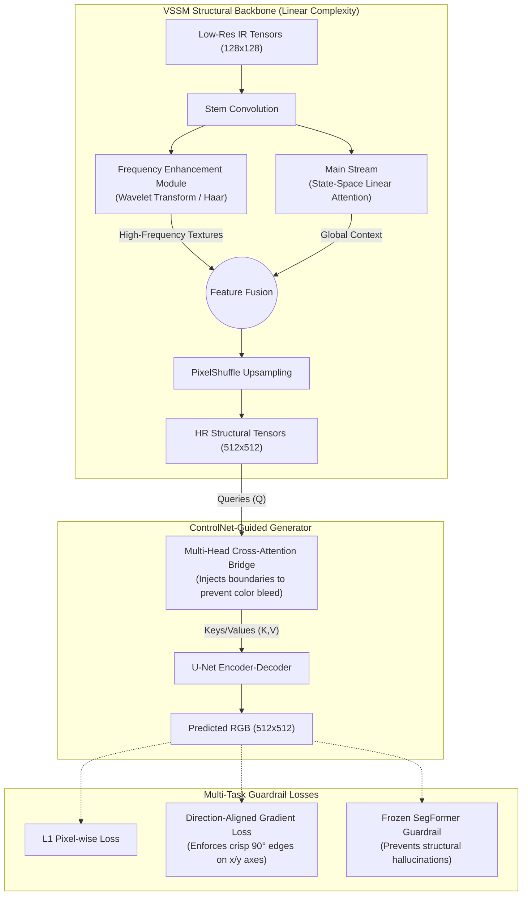
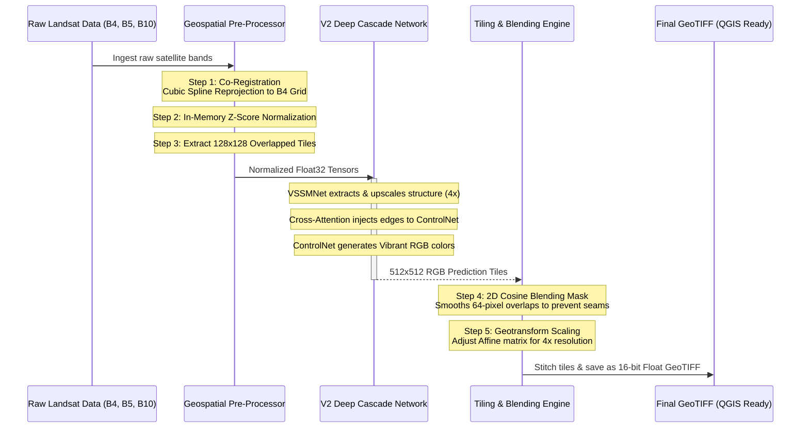
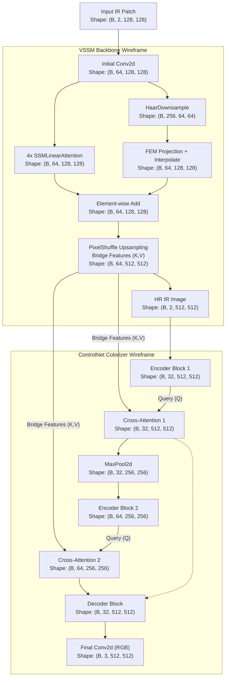

# V2 Architecture and Process Flow

This document outlines the proposed **Dual-Stream, Frequency-Decoupled State-Space Mamba Network with Online Semantic and Direction-Aligned Structural Guardrails** designed to solve ISRO Problem Statement 10.

## 1. Architecture Diagram

This diagram details the deep learning neural network components and how the Structural Network (VSSM) interacts with the Colorization Network (ControlNet).

## 2. Process Flow Diagram

This diagram illustrates the step-by-step data pipeline during inference/production deployment, from raw satellite ingestion to final QGIS-ready output.

## 3. Structural Wireframe Diagram (Tensor Dimensions)

This wireframe maps the exact tensor shapes and transformations as data flows through the neural network layers. It serves as a technical blueprint for the PyTorch implementation.

